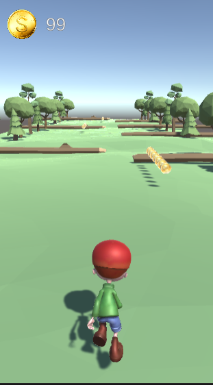
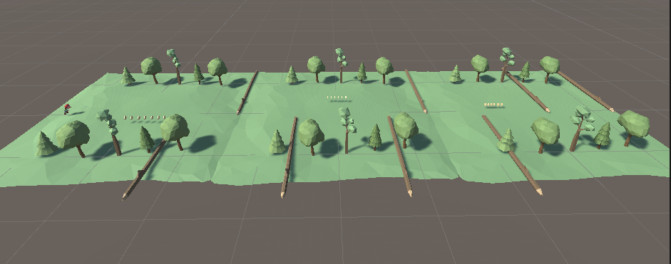

<h1 align="center"> Bootcamp Final Project </h1>  

  

 

## Tools

Technologies I used in the game.

* Cinemachine
* Mixamo for Animation
* Mixamo for Character I used <a href="https://www.mixamo.com/#/?page=1&query=timmy&type=Character">Timmy</a>
* Low-Poly Simple Nature Pack <a href="https://assetstore.unity.com/packages/3d/environments/landscapes/low-poly-simple-nature-pack-162153">JustCreate</a>
 

### Gameplay

 

  

 

 

  

 

 

  

 

