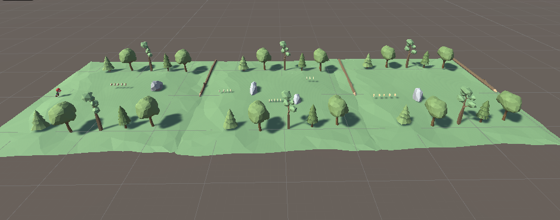

<h1 align="center"> Bootcamp Final Project </h1>  

  

 

## Tools

Technologies I used in the game.

* Cinemachine
* Mixamo for Animation
* Mixamo for Character I used <a href="https://www.mixamo.com/#/?page=1&query=timmy&type=Character">Timmy</a>
* Low-Poly Simple Nature Pack <a href="https://assetstore.unity.com/packages/3d/environments/landscapes/low-poly-simple-nature-pack-162153">JustCreate</a>
 

### Gameplay

 

  

 

 

  

 

 

  

 

## Details
The aim of the game is to collect gold in general. As you collect gold, the number of gold in the upper left increases. The game consists of three levels. When we reach the end of the map, we pass to the new level. The game repeats like this. After the last level, the first level starts again. We have obstacles in the game. When you touch these obstacles, you fail and the level starts again.

